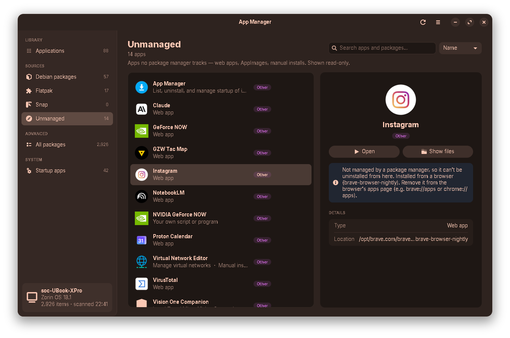

# App Manager

A small GTK app for Linux that shows you **everything installed on your machine**: apt packages, snaps, flatpaks, browser web apps, AppImages and random stuff you dropped in `/opt`. It lets you uninstall things without having to remember which package manager they came from.

I wrote it because on my Zorin box I kept doing the same routine: "is this thing a flatpak or a .deb? what's the package even called? will `apt remove` take half my desktop with it?". The distro's software center only knows about the software it installed itself, and Synaptic shows 3,000 packages with names like `libgnome-desktop-4-2t64`. I wanted one window that answers *what's on this computer* and makes removing things hard to get wrong.

It's a single Python file with no dependencies beyond what a GNOME-based desktop already ships.


---

## What it does

**Layout**

A sidebar on the left (Applications, one entry per source, All packages, Startup apps and System monitor, each with a live count, plus a card showing the machine's hostname, OS and when it was last scanned). The page in the middle has a title, stats ("88 apps · 6.5 GB on disk") and search. On the right, a details panel for whatever you selected. Status messages pop up as a small toast at the bottom instead of a dialog.

**Programs**

- Lists every app the desktop menu can show, with its real name, icon and description, not the package name.
- Covers all the places software comes from:
  - **APT / dpkg**: every installed package (not just the ones you installed by hand), each marked *installed by you* or *came with the system*
  - **Snap**
  - **Flatpak** (system and user installations)
  - **Other**: things no package manager owns: browser web apps (Brave/Chrome "install as app"), AppImages, vendor installers (VMware etc.), your own scripts with a `.desktop` file, and launchers whose program is gone
- **Applications** shows the ~90 things that are actually apps; **All packages** shows all ~2,900, libraries included
- Search (name, description, package id, and the names of extra apps a package bundles) and sort by name or by size on disk
- Details panel: source / "Installed by you" / "Preinstalled" / "Protected" chips, **Open**, **Show files**, **Uninstall**, and a property list (package, version, size, location…)
- Uninstall runs through `pkexec`, so you get the normal system password prompt, and the package manager's output streams into the window while it works

**Startup apps**

- Everything that starts at login, with a switch per entry
- Turning off a *system* entry doesn't touch `/etc`. It writes a per-user override in `~/.config/autostart`, which is how GNOME expects it to be done, and you can switch it back on at any time
- Entries you added yourself can be deleted

**System monitor**

- Headline tiles: CPU usage, CPU temperature, memory in use and GPU temperature
- Two charts of the last 2 minutes, one for CPU usage and one for CPU temperature. Hover them to read any point.
- Per-thread usage and clock speed, memory / swap / free disk space, and **every temperature sensor** the kernel exposes (CPU package and cores, chipset, NVMe, motherboard…)
- How many times the processor has slowed itself down to stay cool since boot (on Intel). On a fanless laptop that number says more than the temperature does.
- Graphics: clock speed, usage and video memory where the driver reports them, plus the temperature
- The busiest programs, with each program's processes added together (Brave's 18 processes show up as one "brave" line)
- Warm, hot and nearly-full readings turn amber or red, and always come with a warning icon and a word, so you don't have to rely on colour
- It only samples while the page is open, and the sidebar shows the CPU temperature while it does


| | |
|---|---|
|  |  |
|  |  |
|  | |

---

## Safety: how it avoids breaking your system

Uninstalling is the one destructive thing this app does, so most of the code around it is there to stop you from shooting yourself in the foot. The rules:

1. **apt removals are simulated first.** Before you're even asked to confirm, it runs `apt-get -s remove <pkg>` (a dry run, no root needed) and shows you **every** package that would go, not just the one you clicked. apt loves to cascade: removing one innocent-looking package can drag the whole desktop metapackage with it.

2. **Protected packages are refused outright.** If the dry run touches anything on the essential list, the app won't do it, full stop. The list (see `_PROTECTED_RE` in the source) covers the base system and the desktop: `zorin-*`, `ubuntu-desktop*`, `gnome-shell`, `gnome-session*`, `gdm3`, `mutter`, `nautilus`, Xorg/Wayland, `systemd*`, `libc6`, `bash`, `dash`, `coreutils`, `dpkg`, `apt`, PAM, polkit/`pkexec`, `sudo`, D-Bus, NetworkManager, plymouth, GRUB, kernel images/headers/firmware, GTK/GLib and `python3` itself. For snaps: `snapd`, the `core*` bases, `bare`, and the GNOME/GTK theme snaps. Protected rows show a lock icon and the Uninstall button is disabled.

3. **Nothing runs through a shell.** Every command is built as an argv list and passed to `subprocess` directly. No `shell=True`, no string formatting into commands, so a package name with weird characters can't turn into command injection.

4. **No stored passwords, no running as root.** The GUI runs as you. Only the actual removal command is elevated, via `pkexec`, one command at a time.

5. **`remove` is the default, `purge` is opt-in.** The checkbox for deleting system-wide config files starts unticked. Your home folder is never touched by apt anyway.

6. **Cancel is the default button** in the confirm dialog, so hammering Enter won't uninstall anything.

7. **"Other" apps are read-only.** If no package manager owns something, there's no safe, reversible way to remove it automatically. So the app tells you what it is and where it lives, and suggests how to remove it (e.g. "remove it from `brave://apps`"), but won't delete files itself.

What it does **not** protect you from: removing an app you actually wanted. It will happily uninstall Firefox if you click through the dialog.

---

## Requirements

- Linux with GTK 3 (developed on **Zorin OS 18**, Ubuntu 24.04 base, GNOME on Wayland)
- Python 3.8 or newer should be fine; I develop and test on 3.12
- PyGObject (`python3-gi`) with the GTK 3 typelib (`gir1.2-gtk-3.0`)
- `pkexec` (polkit) for uninstalling
- Optional, depending on what you use: `dpkg`/`apt`, `snap`, `flatpak`. Missing ones are just skipped.

On a stock Ubuntu/Zorin/Mint desktop all of this is already installed. If not:

```bash
sudo apt install python3-gi gir1.2-gtk-3.0 policykit-1
```

No pip packages, no virtualenv.

## Install & run

```bash
git clone https://github.com/<you>/app-manager.git
cd app-manager
python3 app-manager.py
```

To get it in your app menu, create `~/.local/share/applications/app-manager.desktop`:

```ini
[Desktop Entry]
Type=Application
Name=App Manager
Comment=List, uninstall, and manage startup of installed programs (safe)
Exec=python3 /full/path/to/app-manager/app-manager.py
Icon=system-software-install
Terminal=false
Categories=System;Settings;PackageManager;
Keywords=uninstall;remove;programs;apps;startup;autostart;packages;
```

(Use an absolute path in `Exec=`; `~` isn't expanded there.)

## Keyboard shortcuts

| Key | Action |
|---|---|
| just start typing | search (on any programs page) |
| `Ctrl+F` | focus search |
| `Delete` | uninstall the selected program |
| `F5` / `Ctrl+R` | rescan the computer (on System monitor: take a reading now) |
| `Ctrl+1` … `Ctrl+8` | jump to a sidebar section |

## Command line

The backend works without a display, which is handy over SSH or in scripts:

```bash
python3 app-manager.py --list                 # everything installed, one line each
python3 app-manager.py --list --apps          # only things with a launcher (incl. web apps, AppImages)
python3 app-manager.py --list --apps --json   # same, as JSON
python3 app-manager.py --check gparted        # what would `apt remove gparted` take with it?
python3 app-manager.py --monitor              # one system-monitor snapshot (takes ~1 s)
python3 app-manager.py --monitor --json       # same, as JSON
```

`--monitor` output on my laptop:

```
CPU      Intel Core i7-7Y75 @ 1.30GHz — 4 threads, 25% busy, 2.1 GHz avg (max 3.6 GHz)
         72 °C (CPU package) · slowed down to cool off 817 times since boot
Load     4.42 3.76 3.42 · up 1 h 41 min
Memory   5.0 GB of 7.6 GB used · swap 509 MB of 5.8 GB
Disk     System (/): 88.5 GB free of 221.3 GB
GPU      Intel HD Graphics 615 (i915, integrated) — 300 of 1050 MHz · 72 °C (CPU package sensor)
Temps    CPU package 72 °C, Core 0 72 °C, Core 1 71 °C, Chipset 64 °C, Motherboard 28 °C
Top      brave 11.9%, gnome-shell 3.4%, gnome-system-monitor 1.7%, apps.plugin 1.5%, netdata 1.2%
```

`--check` exit codes, so you can use it in scripts:

| code | meaning |
|---|---|
| 0 | removal is fine, nothing essential in the set |
| 1 | package not installed / nothing to remove |
| 2 | usage error |
| 3 | **blocked**: the removal would take an essential package with it |

```
$ python3 app-manager.py --check gnome-shell
...
BLOCKED: this would remove essential package(s): zorin-os-desktop, gdm3, zorin-desktop-session, gnome-shell, ...
$ echo $?
3
```

---

## How it works

### Finding what's installed

Package managers only know about their own packages, and none of them knows which package is "an app". So the app works from two sides and joins them:

**1. Ask each package manager what it has**

| Source | Command | Notes |
|---|---|---|
| apt | `dpkg-query -W` | Only status `ii` (installed). `rc` = removed but config left behind is skipped. `apt-mark showmanual` decides "installed by you" vs "came with the system". |
| snap | `snap list` | Size = sum of all stored revisions in `/var/lib/snapd/snaps`, since removing a snap frees all of them. |
| flatpak | `flatpak list --app --columns=…` | The size column is locale-formatted (`2,1 MB` with a non-breaking space on a Greek locale, which took me a while to notice), so it gets parsed rather than trusted. |

**2. Read every launcher (`.desktop` file) the desktop would show**

The app walks the XDG application directories in the same precedence order the menu uses: `~/.local/share/applications` first, then everything in `$XDG_DATA_DIRS` (flatpak exports, snap's desktop dir, `/usr/local/share`, `/usr/share`). A launcher in your home folder with the same file name as a system one **overrides** it, just like in the real menu. Launchers with `NoDisplay`/`Hidden`, or excluded by `OnlyShowIn`/`NotShowIn` for your desktop, are ignored.

**3. Match each launcher to an owner**

- Launchers in flatpak's export dir → the flatpak with that app id
- Launchers in snap's desktop dir → the snap named in the file (`<snap>_<app>.desktop`)
- Everything else → one batched `dpkg-query -S` call over all launcher paths to find the owning `.deb`
- Still no owner? Parse the launcher's `Exec=` line (strip `%U`-style field codes and `env VAR=…` prefixes, resolve through `$PATH`) and ask dpkg who owns *that binary*. This catches packaged apps whose launcher you created by hand.
- Still nothing → it's an **Other** app, classified from its `Exec=` line: web app (`--app-id=`), AppImage, something in your home folder, a manual install, or a launcher pointing at a program that no longer exists.

If one package ships several launchers (Maltego plus its Java config tool, or Zorin's Wine bundle with *Browse C: Drive* / *Configure Wine* / *Uninstall Wine Software*), the best match becomes the row's name, and the rest are listed under **Includes** and are searchable.

Whole scan on my machine (2,926 packages, ~90 launchers): about **1.3 s**, most of it `dpkg-query`.

### Icons

Icons come from the launcher's `Icon=` key, either an absolute path or a theme name. One gotcha: if you give GTK a list of icon names (`["org.app.Id", "application-x-executable"]`), it checks *all of them* in the current theme before falling back to `hicolor`. Flatpak icons only live in `hicolor`, so the theme's generic icon won every time. The app resolves the name explicitly with `IconTheme.has_icon()` first.

### Why the list is paged

A GTK 3 `ListBox` is great for pretty rows and terrible at 3,000 of them: switching from "apps only" to "all packages" froze the window for ~10 seconds. Filtering and sorting now happen in plain Python over the item dicts. Only the first 150 matches get real widgets, and more are added when you scroll to the bottom (`edge-reached`). Row widgets are cached, so re-filtering doesn't rebuild them. Toggling the full list now takes ~0.25 s.

### Threads

All the slow stuff (the scan, the apt dry run, the actual uninstall, each system-monitor reading) runs in a worker thread. Results come back to the GTK main loop through `GLib.idle_add`, so the UI never blocks. The uninstall output is streamed line by line into the info bar at the top, so you can see apt doing its thing instead of staring at a spinner.

### System monitor

Everything is read straight from `/proc` and `/sys`, as your normal user. It needs no root, no `lm-sensors` and nothing extra installed.

| Reading | Where it comes from |
|---|---|
| CPU usage | `/proc/stat`. Usage is a rate, so it's the difference between two readings 2 s apart. The first numbers show up about 0.6 s after you open the page. |
| Clock speed | `/sys/devices/system/cpu/cpu*/cpufreq/scaling_cur_freq` |
| Temperatures | every `temp*_input` under `/sys/class/hwmon` (`coretemp`/`k10temp` for the CPU, `amdgpu`/`nouveau` for graphics cards, `nvme`, `pch_*`, `acpitz`…), with each sensor's own critical limit when it reports one. The thermal zones are only a fallback, because some of them report nonsense (one here claims a constant 125 °C). |
| Slowdowns | `cpu0/thermal_throttle/package_throttle_count` (Intel) |
| Graphics | Intel: `gt_act_freq_mhz` and `gt_RP0_freq_mhz` on the DRM card. AMD: `gpu_busy_percent`, `pp_dpm_sclk`, `mem_info_vram_*`. NVIDIA's own driver has no hwmon sensors, so it asks `nvidia-smi` when that's installed. |
| Busiest programs | `/proc/<pid>/stat`, grouped by program name. `python3 script.py` shows as `script.py`, and kernel threads like `kworker/3:2-i915` group as `kworker`. |
| Program memory | PSS from `/proc/<pid>/smaps_rollup`, which splits shared pages between the processes using them, so a browser's 18 processes aren't counted 18 times (Brave: 1.6 GB, against 2.9 GB if you add up resident memory) |

Two things worth knowing about graphics on laptops:

- **Integrated Intel graphics have no temperature sensor of their own.** They sit on the same chip as the CPU, so the reading shown is the CPU package sensor, and the page says so.
- **A dedicated card that has powered itself down is left alone.** If `power/runtime_status` says `suspended`, the page shows "Asleep" and doesn't read it. Reading its sensors (or running `nvidia-smi`) would wake it up and drain the battery.

Cost: a reading takes ~20 ms on this 2-core laptop. Reading PSS is the expensive part (~170 ms when Brave is open), so each process's memory is re-read at most every 10 s. Sampling only runs while the page is visible and stops as soon as you switch away.

---

## Project layout

```
app-manager.py          everything: backend, CLI and GUI (one file on purpose)
docs/screenshots/       images used in this README
```

Inside `app-manager.py`, top to bottom:

| Section | What's there |
|---|---|
| essential-package guard | `_PROTECTED_RE`, `_PROTECTED_SNAP`, `is_protected()` |
| enumeration | `list_apt()`, `list_snap()`, `list_flatpak()`, `list_all()` |
| launchers | `application_dirs()`, `scan_launchers()`, `attach_launchers()`, `.desktop` parsing, Exec-line parsing |
| removal planning | `simulate_apt_remove()`, `remove_command()` |
| autostart | `list_autostart()`, `set_autostart_enabled()`, `remove_autostart()` |
| system monitor | `SystemSampler` (one reading = `sample()`), `cpu_model()`, `list_gpus()`, `_hwmon_temps()`, `_friendly_temps()`, `_gpu_reading()` |
| CLI | `--list`, `--apps`, `--json`, `--check`, `--monitor` |
| GUI | `_VIEWS` (sidebar sections), `_CSS` (the stylesheet), `_VIZ`/`_METER_CSS` (chart and meter colours), `run_gui()`: window, sidebar, rows, details panel, dialogs, `MeterRow`/`StatTile`/`HistoryChart` |

The backend functions don't import GTK, so you can import the file and use them from another script.

---

## Known limitations

- **Only this machine.** It reads the local system. Scanning a remote box over SSH isn't there (yet).
- **Other users' per-user installs aren't visible.** Flatpaks installed with `--user` by *another* account, or launchers in another user's home, need that user's session (or root) to read. System-wide stuff is covered.
- **"Other" apps can't be removed from the app**, on purpose (see the safety section). A "move to trash" option for AppImages and user launchers would be safe and reversible. That's on the list.
- **apt/dpkg-based distros only** for native packages. Fedora (`dnf`/`rpm`), Arch (`pacman`) and openSUSE (`zypper`) aren't supported. Snap and flatpak work anywhere.
- **"Installed by you" is apt's opinion.** It's `apt-mark showmanual`, which also counts things the installer marked manual during OS setup.
- **Snap/flatpak dependency cascades aren't previewed** the way apt's are. Removing a flatpak app leaves its runtime in place (`flatpak uninstall --unused` cleans that up), and snap base snaps are protected anyway.
- The protected list is tuned for Ubuntu-family GNOME desktops (Zorin, Ubuntu, Pop!_OS-ish). On KDE or XFCE you'd want to add `plasma-*` / `xfce4-*` etc. to `_PROTECTED_RE`.
- Only tested on Zorin OS 18 (GNOME, Wayland). It should work on Ubuntu 22.04+ and Mint, but I haven't tried.
- **System monitor: the AMD and NVIDIA graphics paths are untested.** This laptop only has Intel graphics. Those code paths follow the kernel's documented sysfs files and `nvidia-smi`'s CSV output, but no real card has been tried yet.
- **No usage percentage for Intel graphics.** The kernel only reports that through `perf`, which needs root. The page shows the graphics clock speed instead.

## Contributing

Issues and PRs welcome. A few ground rules, because this thing deletes software:

- Never build a command with string formatting or `shell=True`. Argv lists only.
- Anything that removes or changes system state must go through a preview + confirm step first.
- If you add a package source (dnf, pacman…), add its essential packages to the guard **in the same PR**.
- Test the `--check` path against something that must be refused (`gnome-shell`, `systemd`, `libc6`) before sending.

Quick sanity check before a PR:

```bash
python3 -m py_compile app-manager.py
python3 app-manager.py --list --apps | tail -1
python3 app-manager.py --check gnome-shell; echo "exit=$?"   # must print BLOCKED, exit=3
```
